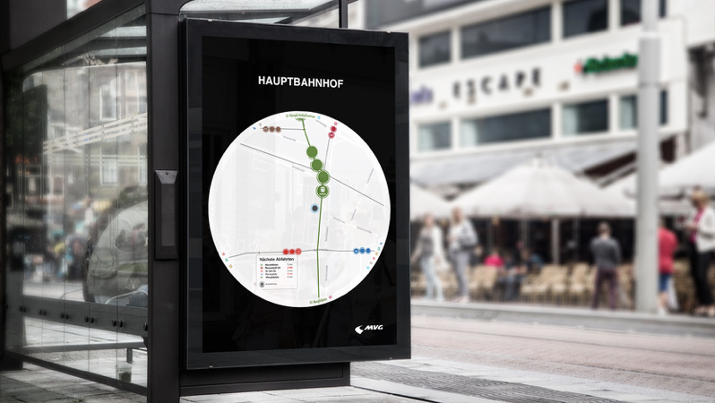
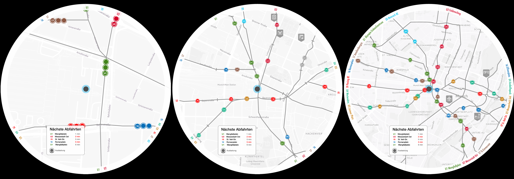

Daria Babco, Dario Capuana, Fabian Kargl, Katja Lüttig, Teresa Herzog
# Glücksrad
## Better commuting through livedata visualization

Imagine not wasting your time with waiting. Our product is an interactive display that lets commuters explore public transportation in Munich at first sight. It is located at several train stations showing live data. 
 
Being daily commuters ourselves we targeted our biggest problems with public transport: being uninformed while waiting for a train or bus. We challenged ourselves to generate real benefit from all the data that can be collected concerning public transport. Always with our proposal in mind: “waiting brings happiness.”
 
### Product
The “Glücksrad”  is a circular display with 90cm in diameter. The commuters position is centered on the display. You can see the public transport around you in three different zoom steps. 

[picture of zoom 1] Detailed zoom with a diameter of 300 meters
[picture of zoom 2] Standard zoom with a diameter of 700 meters
[picture of zoom 3] Overall zoom with a diameter of 1.4 kilometer
[noch 2 sätze dazu dass du andere sachen siehst in anderen zoomstufen]
[picture/gif of ring]We used the round shape to display the name and the final station of the transportation lines in the outer ring.
 
#### Icons
[pic of icons]
The means of transport are presented as a circle displaying the coherent number of the train or bus. The ring indicates the number of passengers in each transport containers. Because this is a new form of displaying information we want to make the filling level feel intuitive like water pouring into the container. [was zu den ausgefahrenen großen icons]
 
We set a specific icon for each landmark to differentiate between them on the map. We depict them in grey map markers instead of hiding them behind regular map markers.
 
#### Colors
We applied the same colors to our icons as the actual colors of the transportation lines to make it easy to find your usual train or bus by the color. In order to not clash these colors we decided to only use different shades of grey. 
 
 [mehr Produktbeschreibung]
 
### Design Process

To create our product we followed the method of the design sprint. This consists of the following steps: Define the problem, brainstorm alone but discuss together, produce fast solutions, test them and iterate them. 

After we received information about mobility and different data visualization approaches we interviewed our partner MVG. We then set our focus on the needs of the commuters. Following that, we defined user stories:

As a commuter I want to know the reason for delays in order to be better informed, understand my situation and decide whether to stay or to pick an alternative route.
As a commuter with full bags and a bike I want to know about the fullness of the train so I can decide which one to take without disturbing other people.
As a tourist I want to see at first glance how to find my way around Munich and in order to gain I can gain more from my trip.

We asked ourselves questions and tried to collect answers to see our possibilities and our limits: What is the data we will receive, what can we measure? Then we also gathered: What makes the commuter happy, what are his pain points, which interactions are possible and what can we do with that now?

[Photo of first drafts]

We tried to depict first solutions, usually everyone sat down and worked on his or her own for a limited time and then we got together to discuss them. We quickly decided that we want to redefine the touchpoints between the commuter and the public transportation at the bus stop to provide relevant information for that location to have a stressless ride. The regular display panel at the stops does not transport enough information - there is a lot more we can show besides the incoming trains and heavy incidents. Most important is the location of the incoming trains but also the ones that recently drove off. This helps the user a lot to gain an overview of the situation he/she is in. Besides that, we want them to see the filling level of the train to provide them the opportunity to decide whether to take the full train or wait for the next one. 

### Code
@Dario

### Vision
We want to make our Glücksrad accessible from the mobile phone where commuters can see where their bus is while they are still at home. 

For more infotainment at the bus stop we want to provide more visualized data about public transportation: Filling levels over a day or a specific station, showing popular stops by visualizing mobility flows, visualizing speed levels ...

### Conclusion
Our Glückrad provides new and important information to different kinds of commuters according to their needs. It brings more transparency to public transportation which results in more trust in MVG. Our display also  shapes the city scape and transports a modern image of MVG.

This interdisciplinary project was realized by computer science and design students of the University of Applied Sciences Mannheim, in cooperation with the Münchner Verkehrsbetriebe (MVG). Supervision by Prof. Dr. Till Nagel and Christian Schäfer.
