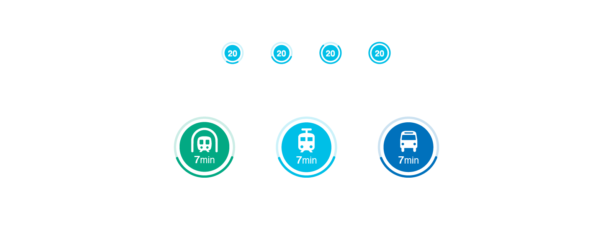
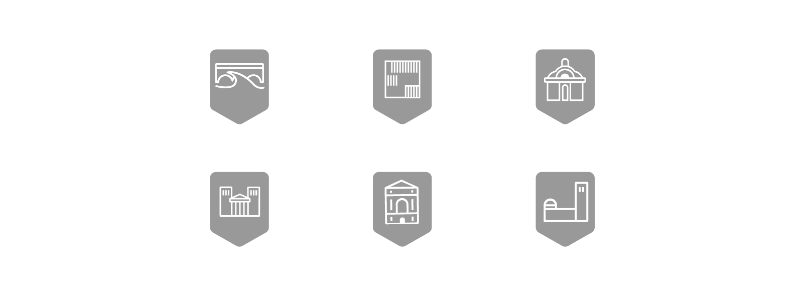
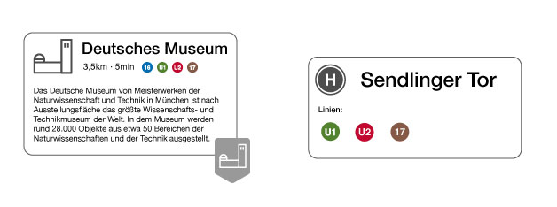
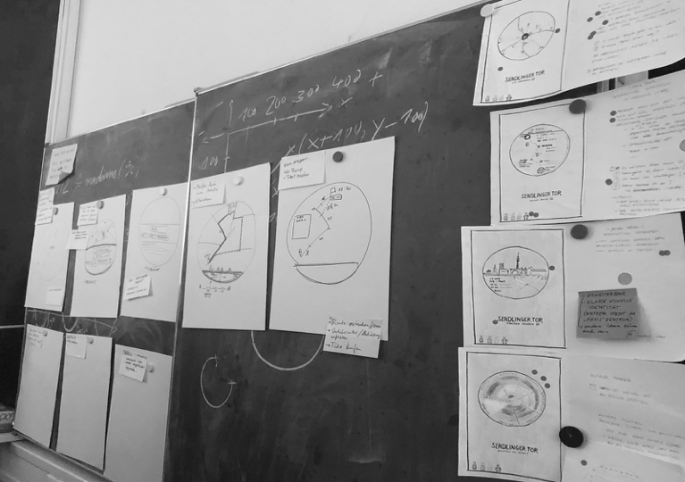
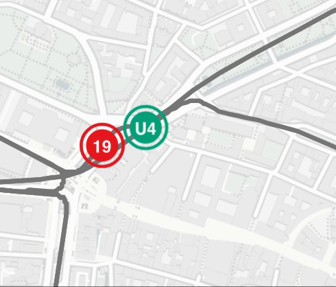

   
*Interactive display at tram station*

# Glücksrad
## Better commuting through live data visualization

Imagine not wasting your time while waiting. Our product is an interactive display that lets commuters explore public transportation in Munich at first sight. It is located at several train stations for bus, tram and subway showing live data. 

Being daily commuters ourselves we targeted our biggest problems with public transport: being uninformed while waiting for a train or bus. We challenged ourselves to generate real benefit for the customer from all the data that can be collected concerning public transport.

With our display we want to help the commuter...

...to find incredibly fast the best train for his individual needs.  
...to travel more relaxed and comfortable.  
...to sweeten the wait by infotaiment.  

Always with our goal in mind: “waiting brings happiness.”
 
### Product
The “Glücksrad”  is a circular display with 90cm in diameter. The commuters position is centered on the display. You can see the public transport around you in three different zoom steps. 

*The first image displays a detailed zoom with a diameter of 300 meters. 
The second image displays a detailed zoom with a diameter of 700 meters. 
The third image displays a detailed zoom with a diameter of 1.4 kilometers.*

The image on the left depicts zoom 1 which is zoomed in the most of the three zoom steps. It shows your direct surroundings with a diameter of about 300 meters. This relates to the distance in which you perceive your surroundings. The transportation containers are displayed with the actual amount of carts.

Zoom 2 is displayed in the middle picture. We chose to set this one as our standard view which can be seen when the display is unused. Its diameter is about 700 meters and includes landmarks and train or bus stations. The individual transportation containers are illustrated as circles.

Zoom 1 and 2 show the name of the container number in the outer ring which will expand to the final station of the route when selected. Zoom 3, however, displays all the final stations at all times to give a better overview. It has a diameter of 1.4 kilometers and therefore gives you a good feeling of where you are in the city.

Each transportation container, train station and route can be clicked on. The landmarks and stations provide a box with specific topic related information. When a route is selected it gets highlighted so you can see immediately where you are going.

We used the round shape to display the name and the final station of the transportation lines in the outer ring.
 
#### Icons

The means of transport are presented as a circle displaying the coherent number of the train or bus. When a line is selected all icons of this line get bigger and the corresponding symbol for subway, tram or bus is displayed.

The ring around the icon indicates the number of passengers in each transport container and thus allows a forecast of the likelihood for a seat. As this is a new form of displaying information it was important for us to make the filling level feel intuitive like water pouring into the container.

The most accurate view of the filling level we provide in zoom 1: here the transportation containers are displayed with the actual amount of carts and for every single cart the ring displays the specific filling level.

We set a specific icon for each landmark to differentiate between them on the map. We depict them in grey map markers instead of hiding them behind regular map markers.

  

By tapping a landmark a pop-up window with a brief description of the attraction appears. We show the distance to the landmark and the lines to get there. In the background the commuter can still see the overview of all lines driving in real time on our display. At a glance the customer can identify which line is currently the fastest to get to the landmark. We use the same principle when a specific stopping point is selected.
 
#### Colors
We applied the same colors to our icons as the actual colors of the transportation lines to make it easy to find your usual train or bus by the color. In order to not clash these colors we decided to only use different shades of grey. 
 
 <!--[mehr Produktbeschreibung]-->
 
 

 
### Design Process

To create our product we followed the method of the design sprint. This consists of the following steps: Define the problem, brainstorm alone but discuss together, produce fast solutions, test them and iterate them. 

After we received information about mobility and different data visualization approaches we interviewed our partner MVG. We then set our focus on the needs of the commuters. Following that, we defined user stories:

As a commuter I want to know the reason for delays in order to be better informed, understand my situation and decide whether to stay or to pick an alternative route.
As a commuter with full bags and a bike I want to know about the fullness of the train so I can decide which one to take without disturbing other people.
As a tourist I want to see at first glance how to find my way around Munich and in order to gain I can gain more from my trip.

We asked ourselves questions and tried to collect answers to see our possibilities and our limits: What is the data we will receive, what can we measure? Then we also gathered: What makes the commuter happy, what are his pain points, which interactions are possible and what can we do with that now?

  

We tried to depict first solutions, usually everyone sat down and worked on his or her own for a limited time and then we got together to discuss them. We quickly decided that we want to redefine the touchpoints between the commuter and the public transportation at the bus stop to provide relevant information for that location to have a stressless ride. The regular display panel at the stops does not transport enough information - there is a lot more we can show besides the incoming trains and heavy incidents. Most important is the location of the incoming trains but also the ones that recently drove off. This helps the user a lot to gain an overview of the situation he/she is in. Besides that, we want them to see the filling level of the train to provide them the opportunity to decide whether to take the full train or wait for the next one. 

### Prototype
<!-- @Dario -->
#### Design Arrangement
To ensure the prototype was close to the result of our design process, we early decided us for the main concept. As a conclusion we were able to implement the main functions of the product using placeholders (e.g. circle = train). As the symbols could easily be replaced with svgs, we arranged us to use adobe illustrator to realize our scribbles, as it's simple to export the results as svgs. In addition the meeting time was mostly used to define what should happen on which interaction so the features were exactly described after each meeting. On the other hand we used the time to decide which features are must-have, so the implementation was more focused. Each result was communicated at these meetings and if there were any problems we arranged together how we could handle it.

#### Technologies
The Prototype is a web application running on a NodeJS express server. The server is used to provide static data like svgs and get live data from the mvg api. The vehicle animations and visual effects like resizing were realized with the D3.js libary on a SVG layer. Leaflet was used to display the map, markers and routes. Python was used for data processing, like mapping the train stations to the route and filter single routes for every line as well as align the Coordinates into the correct order.

#### Features

##### Animations

  

Every vehicle drives along its real daily route with its own speed. Live Data was included here so there was one symbol for every real vehicle driving at the moment in the real direction using an average driving time and a time based starting point. 
(This feature was/is implemented but the @lynbarry/mvg-api module is currently broken so the application is running with mocked data as the module doesn't provide live data anymore.

##### Hover and Click

  

The single routes are clickable and have a hover effect on it. The user is able to click on the route or on the vehicle so the route and all vehicles using them will be highlighted. Additionally the vehicle symbols of the line will be switched out to a more detailed symbol and the route changes its color to its actual line color. 

##### Zoom

  

Its possible to zoom in and out of the application keeping the main station centered and every element on its position.

##### Markers

  

The landmarks are clickable and showing informations about the clicked landmark.

#### Full Prototype

You can see the prototype in action by watching this [video](https://vimeo.com/314707640).  
You can also host the prototype on your own environment following this [readme](https://github.com/GFdiablo117/APV/blob/master/Prototyp/readme.md).

### Vision
We want to make our Glücksrad accessible from the mobile phone where commuters can see where their bus is while they are still at home. 

For more infotainment at the bus stop we want to provide more visualized data about public transportation: Filling levels over a day or a specific station, showing popular stops by visualizing mobility flows, visualizing speed levels ...

### Conclusion
Our Glückrad provides new and important information to different kinds of commuters according to their needs. It brings more transparency to public transportation which results in more trust in MVG. Our display also  shapes the city scape and transports a modern image of MVG.

This interdisciplinary project was realized by computer science and design students of the University of Applied Sciences Mannheim, in cooperation with the Münchner Verkehrsbetriebe (MVG). Supervision by Prof. Dr. Till Nagel and Christian Schäfer.

Daria Babco, Dario Capuana, Fabian Kargl, Katja Lüttig, Teresa Herzog
